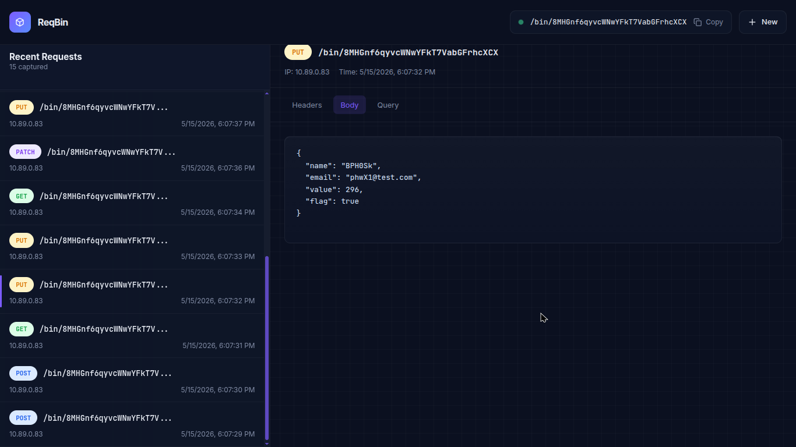

# Reqbin

> Lightweight RequestBin clone focused on real-time request inspection, backend architecture, and self-hostable infrastructure.


## Features

- Generate temporary request endpoints
- Real-time request inspection powered by WebSockets
- Live request synchronization without polling
- Request detail inspection:
  - Headers
  - Body
  - Query parameters
  - HTTP method
- Persistent request history
- Automatic bin expiration after 24 hours
- Redis-backed rate limiting
- Middleware-based security layer
- Self-hostable architecture
- Lightweight containerized setup

---

# Tech Stack

## Frontend

- Vue 3
- TypeScript
- Pinia
- Laravel Echo

## Backend

- PHP 8.3
- SQLite
- Redis

## Realtime

- Soketi
- WebSockets
- Pusher Protocol

## Infrastructure

- Podman / Docker
- Nginx
- Multi-container architecture

---

# Installation

## Prerequisites

- Podman or Docker

---

# Running Locally

## Clone repository

```bash
git clone https://github.com/k4ik/reqbin.git
cd reqbin
```

## Start containers

```bash
podman compose up -d --build
```

or

```bash
docker compose up -d --build
```

---

# Architecture

Reqbin follows a lightweight layered backend architecture inspired by modern backend frameworks.

## Backend Layers

- Controllers handle HTTP requests
- Services contain business logic
- Repositories manage persistence
- DTOs standardize request data
- Workers handle background cleanup tasks
- Middleware handles request processing and security

## Middleware System

Reqbin includes a custom middleware pipeline responsible for:

- Rate limiting
- Security headers
- CORS handling
- Request validation
- Payload protection

## Infrastructure Components

```txt
Vue Frontend
      ↓
Nginx Container
      ↓
PHP API
      ↓
Redis (rate limiting)
      ↓
SQLite Persistence
      ↓
Soketi WebSocket Server
```

---

# Realtime Flow

```txt
Incoming Request
        ↓
PHP Backend
        ↓
Middleware Pipeline
        ↓
SQLite Persistence
        ↓
Soketi Broadcast
        ↓
Vue Frontend Sync
```

---

# Project Structure

```txt
.
├── backend/
│   ├── app/
│   │   ├── Controllers/
│   │   ├── Core/
│   │   ├── DTO/
│   │   ├── Middlewares/
│   │   ├── Repositories/
│   │   ├── Services/
│   │   └── Workers/
│   │
│   ├── public/
│   └── storage/
│
├── frontend/
│   ├── src/
│   │   ├── components/
│   │   ├── composables/
│   │   ├── helpers/
│   │   ├── stores/
│   │   └── types/
│
└── README.md
```

---

# Security Features

Reqbin implements several API protection mechanisms:

- Redis-backed IP rate limiting
- Middleware-based request validation
- Security headers
- CORS handling
- Payload size protection
- Randomized bin identifiers
- Centralized error handling

---

# How It Works

1. Create a temporary bin
2. Send requests to the generated endpoint
3. Reqbin captures and stores the request
4. Requests are broadcast through WebSockets
5. Frontend updates in real-time
6. Background workers clean expired bins

---

# Example Request

```bash
curl -X POST http://localhost:8000/bin/:bin \
  -H "Content-Type: application/json" \
  -d '{"message":"hello world"}'
```

---

# Screenshots


# Project Goals

Reqbin was built to explore:

- WebSocket communication
- Request inspection systems
- Backend architecture patterns
- Middleware pipelines
- Rate limiting strategies
- Containerized infrastructure
- Self-hostable developer tooling
- Real-time fullstack systems

---

# Roadmap

- [x] Real-time request updates
- [x] Request storage
- [x] Request detail viewer
- [x] Automatic bin expiration
- [x] Redis-backed rate limiting
- [x] Middleware pipeline
- [x] Security improvements
- [x] Better UI/UX
- [ ] Request filtering
- [ ] Request search
---

# Contributing

Contributions, issues, and feature requests are welcome.

1. Fork the repository
2. Create your feature branch
3. Commit your changes
4. Push your branch
5. Open a Pull Request

---

# License

This project is licensed under the MIT License.